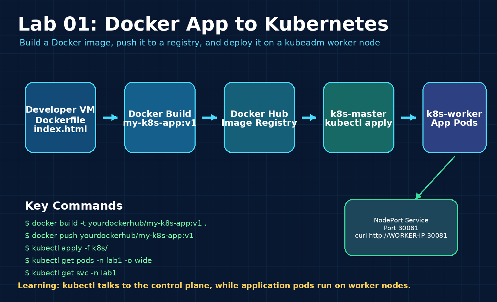

# Deploy a Dockerized Web App to Kubernetes

## Objective

Build a simple Nginx-based Docker image and deploy it to a kubeadm Kubernetes cluster.

## What This Lab Covers

- Creating a simple Dockerfile
- Building a Docker image
- Pushing image to Docker Hub
- Creating a Kubernetes Deployment
- Exposing the application using NodePort
- Verifying the pod is running on the worker node

## Architecture



Mermaid version: [architecture.mmd](diagrams/architecture.mmd)

## Flow

```text
Developer VM
   ↓
Build Docker image
   ↓
Push image to Docker Hub
   ↓
kubectl apply from k8s-master
   ↓
Pod runs on k8s-worker
   ↓
Access using NodePort
```

## Prerequisites

- Docker installed on build VM
- kubeadm cluster running
- kubectl configured on master node
- Docker Hub account
- Worker node should have internet access to pull images

## Step 1: Create Application Files

```bash
cd app
```

Files:

```text
Dockerfile
index.html
```

## Step 2: Build Docker Image

Replace `yourdockerhub` with your Docker Hub username:

```bash
docker build -t yourdockerhub/my-k8s-app:v1 .
```

## Step 3: Push Image to Docker Hub

```bash
docker login
docker push yourdockerhub/my-k8s-app:v1
```

## Step 4: Update Kubernetes Deployment Image

Edit:

```bash
nano k8s/deployment.yaml
```

Replace:

```yaml
image: yourdockerhub/my-k8s-app:v1
```

with your actual Docker Hub image.

## Step 5: Deploy to Kubernetes

```bash
kubectl apply -f k8s/
```

## Step 6: Verify Resources

```bash
kubectl get pods -n lab1 -o wide
kubectl get svc -n lab1
```

Expected service output:

```text
my-k8s-app   NodePort   ...   80:30081/TCP
```

## Step 7: Access the Application

```bash
curl http://WORKER-IP:30081/
```

Example:

```bash
curl http://192.168.100.70:30081/
```

## Useful Commands

```bash
kubectl get all -n lab1
kubectl describe pod -n lab1 POD-NAME
kubectl logs -n lab1 deployment/my-k8s-app
kubectl get pods -n lab1 -o wide
```

## Cleanup

```bash
kubectl delete namespace lab1
```

## Key Learning

Kubernetes deployments are submitted through the control plane, but the application pod normally runs on the worker node.
